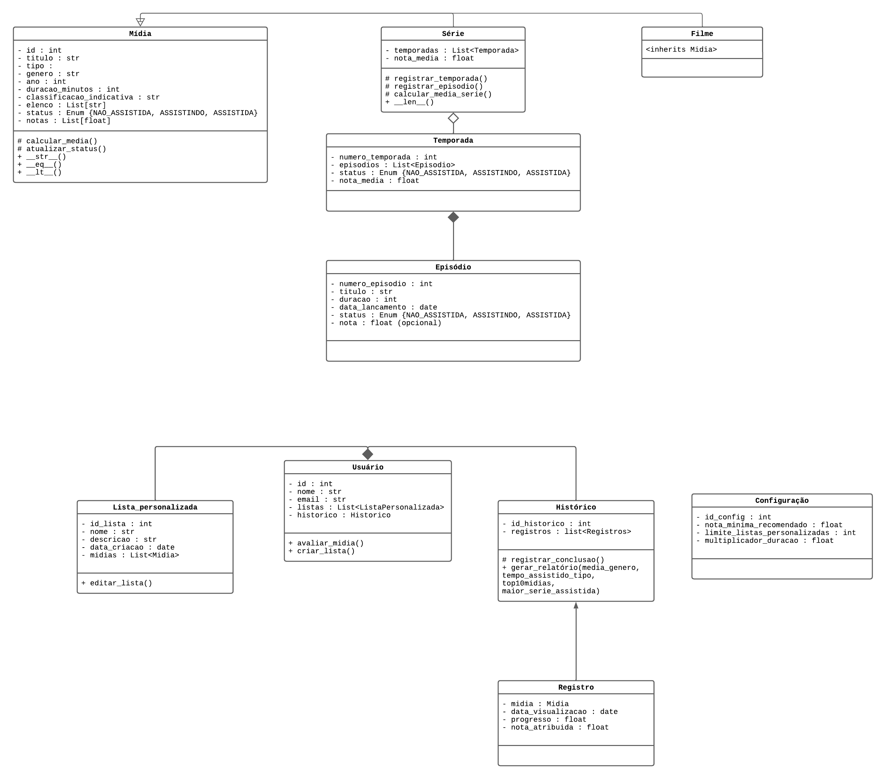

# 🎬 Catálogo de Filmes e Séries

Sistema desenvolvido em **Python** para gerenciamento de um catálogo de filmes e séries, permitindo ao usuário cadastrar mídias, criar listas personalizadas, avaliar conteúdos e gerar relatórios de consumo.  
Projeto baseado no **Tema 10 — Catálogo de Filmes e Séries**, da disciplina de **Programação Orientada a Objetos (UFCA)**.

---

## 🧱 Estrutura do Sistema

O sistema é orientado a objetos e estruturado com base no **diagrama UML** a seguir, que representa as classes principais e seus relacionamentos de herança, agregação e composição:



### 🧩 Descrição das Classes

- **Midia** → Classe base responsável pelo registro de filmes e séries do catálogo.
- **Filme** → Herda de `Midia`, sendo responsável pelo controle das mídias classificadas como filme.
- **Serie** → Herda de `Midia`, sendo responsável pelo controle das mídias classificadas como série e suas temporadas.
- **Temporada** → Controla os atributos de temporada das mídias de séries.
- **Episodio** → Responsável pelo controle de episódios que se agregam à classe de temporada.
- **Usuario** → Responsável pelo controle de configurações e dados individuais do usuário.
- **ListaPersonalizada** → Responsável pela representação de listas personalizadas de mídias para cada usuário.
- **Historico** → Responsável por receber e armazenar os registros de conclusão de visualização das mídias.
- **RegistroVisualizacao** → Responsável por armazenar as instâncias (dados) do que será salvo no histórico.
- **Configuracao** → Responsável pelo controle de algumas configurações de limite e estado do sistema.


---

## ⚙️ Funcionalidades Principais

- Cadastro e gerenciamento de filmes e séries (CRUD completo).  
- Criação de listas personalizadas de mídias.  
- Registro de progresso e notas de visualização.  
- Cálculo automático de notas médias para séries e temporadas.  
- Relatórios estatísticos:
  - Média de notas por gênero;
  - Tempo total assistido por tipo;
  - Top 10 mídias assistidas;
  - Série mais assistida.

---

## 🧩 Tecnologias Utilizadas

- **Linguagem:** Python 3.12+
- **Paradigma:** Programação Orientada a Objetos (POO)
- **Bibliotecas padrão:**
  - `json` → persistência de dados e configurações  
  - `datetime` → manipulação de datas  
  - `enum` → definição de status e tipos  
  - `typing` → uso de listas e tipagem genérica  
- **Formato de persistência:** arquivos `.json` (ex: `midias.json`, `usuarios.json`, `settings.json`)

---

## 🧠 Organização do Projeto
A estrutura de diretórios do projeto segue o padrão modular da Programação Orientada a Objetos, facilitando a manutenção e o reuso de código.

```text
catalogo-de-filmes-e-series/
│
├── main.py               # Arquivo principal para execução do sistema
├── dados.py              # Módulo de funções para persistência (salvar/carregar JSON)
│
├── classes/               # Pacote contendo as classes do sistema
│   ├── midia.py
│   ├── filme.py
│   ├── serie.py
│   ├── temporada.py
│   ├── episodio.py
│   ├── usuario.py
│   ├── lista_personalizada.py
│   ├── historico.py
│   ├── registro_visualizacao.py
│   └── configuracao.py
│
├── data/                 # Armazena arquivos de dados e configurações
│   ├── midias.json
│   ├── usuarios.json
│   └── settings.json
│
├── docs/                 # Documentação do projeto
│   └── uml_catalogo_midias.png
│
└── README.md             # Documentação geral do projeto
